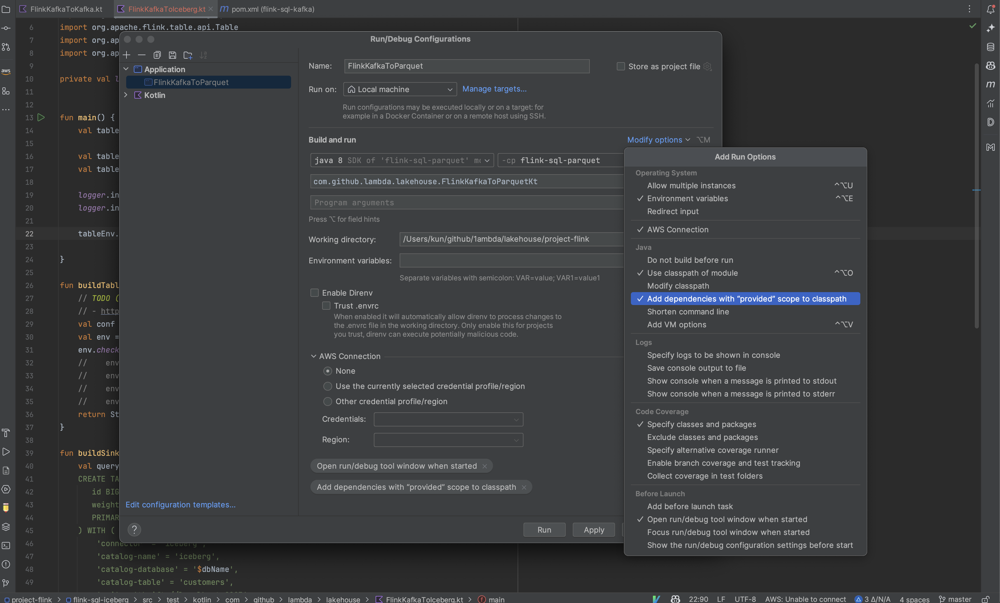
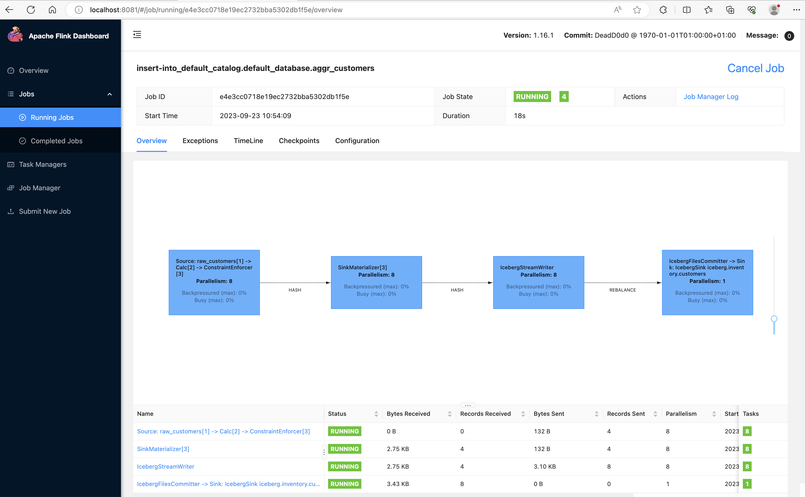
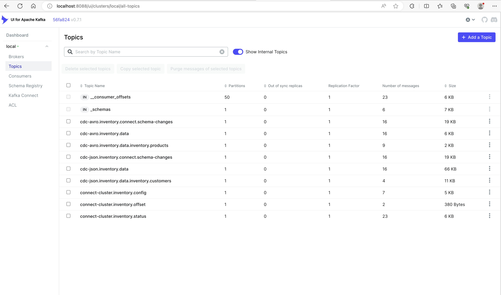
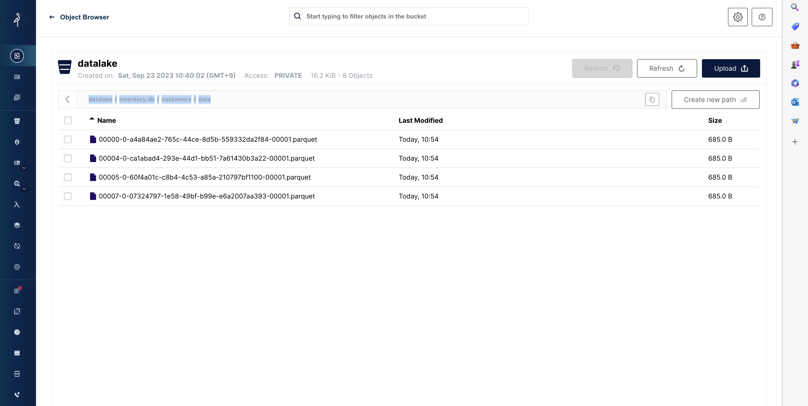
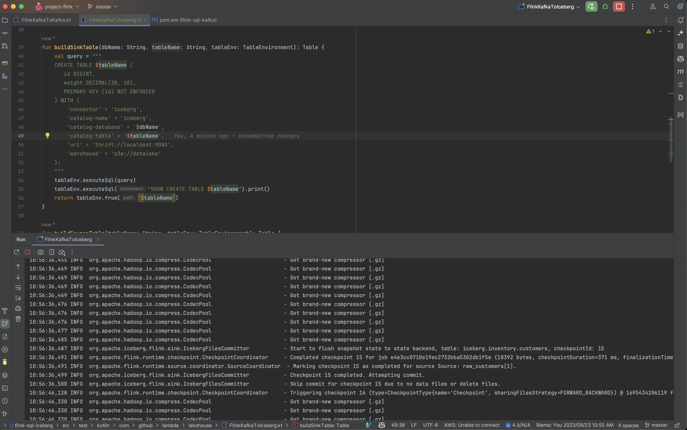

# Lakehouse Playground


Supported Data Pipeline Components

| Pipeline Component                     | Version | Description              |
|----------------------------------------|---------|--------------------------|
| [Trino](https://trino.io/)             | 425+    | Query Engine             |
| [DBT](https://www.getdbt.com/)         | 1.5+    | Analytics Framework      |
| [Spark](https://spark.apache.org/)     | 3.3+    | Computing Engine         |
| [Flink](https://flink.apache.org/)     | 1.16+   | Computing Engine         |
| [Iceberg](https://iceberg.apache.org/) | 1.3.1+  | Table Format (Lakehouse) |
| [Hudi](https://hudi.apache.org/)       | 0.13.1+ | Table Format (Lakehouse) |
| [Airflow](https://airflow.apache.org/) | 2.7+    | Scheduler                |
| [Jupyterlab](https://jupyter.org/)     | 3+      | Notebook                 |
| [Kafka](https://kafka.apache.org/)     | 3.4+    | Messaging Broker         |
| [Debezium](https://debezium.io/)       | 2.3+    | CDC Connector            |

<br/>

## Getting Started

Execute compose containers first.

```bash
# Use `COMPOSE_PROFILES` to select the profile
COMPOSE_PROFILES=trino docker-compose up;
COMPOSE_PROFILES=spark docker-compose up;
COMPOSE_PROFILES=flink docker-compose up;
COMPOSE_PROFILES=airflow docker-compose up;

# Combine multiple profiles
COMPOSE_PROFILES=trino,spark docker-compose up;

# for CDC environment (Kafka, ZK, Debezium)
make compose.clean compose.cdc

# for Stream environment (Kafka, ZK, Debezium + Flink)
make compose.clean compose.stream
```

Then access the lakehouse services.

- Kafka UI: http://localhost:8088
- Kafka Connect UI: http://localhost:8089
- Trino: http://localhost:8889
- Airflow (`airflow` / `airflow`) : http://localhost:8080
- Local S3 Minio (`minio` / `minio123`): http://localhost:9000
- Flink Job Manager UI (Docker): http://localhost:8082
- Flink Job Manager UI (LocalApplication): http://localhost:8081
- PySpark Jupyter Notebook (Iceberg): http://localhost:8900
- PySpark Jupyter Notebook (Hudi): http://localhost:8901
- Spark SQL (Iceberg): `docker exec -it spark-iceberg spark-sql`
- Spark SQL (Hudi): `docker exec -it spark-hudi spark-sql`
- Flink SQL (Iceberg): `docker exec -it flink-jobmanager flink-sql-iceberg`
- Flink SQL (Hudi): `docker exec -it flink-jobmanager flink-sql-hudi;`

<br/>

## CDC Starter kit

```bash
# Run cdc-related containers
make compose.cdc;

# Register debezium mysql connector using Avro Schema Registry
make debezium.register.customers;

# Register debezium mysql connector using JSON Format
make debezium.register.products;
```

### Running Flink Applications

Flink supports Java 11 but uses Java 8 due to its SQL (Hive) dependency.
The Flink SQL Application within this project is written in Kotlin for SQL Readability.


You can run it as an Application in IDEA. (it is not a Kotlin Application)
For Flink Application, the required dependencies are already included within the Production Docker Image or EMR cluster.

Therefore, they are set as 'Provided' dependencies in the Maven project, so to run them locally,
you can include the `Add dependencies with "provided" scope to classpath"` IDEA option as shown in the screenshot below.

After running the Local Flink Application, you can access the Flink Job Manager UI from localhost:8081.




## DBT Starter kit

```bash
# Run trino-related containers
make compose.dbt;

# Prepare iceberg schema
make trino-cli;
$ create schema iceberg.staging WITH ( LOCATION = 's3://datalake/staging' );
$ create schema iceberg.mart WITH ( LOCATION = 's3://datalake/mart' );

# Execute dbt commands locally
cd dbts;
dbt deps;
dbt run;
dbt test;
dbt docs generate && dbt docs serve --port 8070; # http://localhost:8070

# Select dbt-created tables from trino-cli
make trino-cli;
$ SELECT * FROM iceberg.mart.aggr_location LIMIT 10;
$ SELECT * FROM iceberg.staging.int_location LIMIT 10;
$ SELECT * FROM iceberg.staging.stg_nations LIMIT 10;
$ SELECT * FROM iceberg.staging.stg_regions LIMIT 10;

# Execute airflow dags for dbt
make airflow.shell;
airflow dags backfill dag_dbt --local --reset-dagruns  -s 2022-09-02 -e 2022-09-03;
```

## Screenshots

### Flink Job Manager UI


### Kafka UI


### Minio UI


### Running Local Flink Application in IDEA

